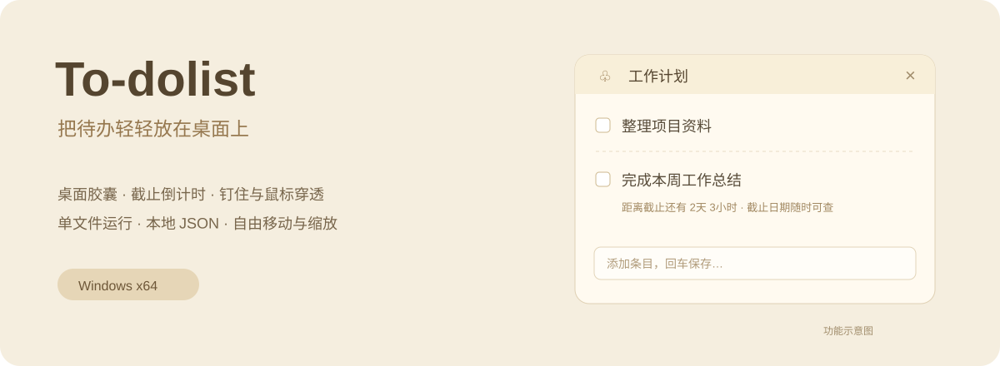
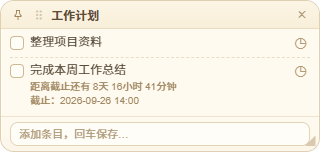
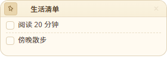

# To-dolist

**把待办放在桌面上，想起时看一眼，需要时改两笔。**



To-dolist 是一个面向 Windows 的桌面胶囊待办小工具。多个清单可以分别摆放在桌面上，支持截止日期、剩余时间、归档，以及钉住后的鼠标穿透。数据保存在程序旁边的 `data.json`，不需要注册账号。

这是一个参考 **PaperTodo** 的外观与使用思路，在 AI 辅助下逐步仿改、调整的个人学习项目，此软件仅限个人免费使用，禁止商业。

## 界面预览

下图是程序使用**演示数据**生成的截图，不含个人待办。日期和倒计时仅用于展示。

| 编辑状态 | 钉住状态 |
| --- | --- |
|  |  |

更详细的图文说明见 [软件介绍](docs/软件介绍.md)。

## 可以做什么

- **多个独立胶囊**：按工作、生活等主题分别建立清单。
- **自由摆放**：取消钉住后，拖动标题旁的手柄移动，拖动边缘或角落缩放；保存位置与尺寸。
- **钉住与穿透**：钉住后锁定内容，主体区域鼠标穿透；独立的取消钉住按钮仍可点击。
- **截止日期与提醒**：显示完整截止日期、剩余天／小时／分钟，过期后显示逾期时长；支持提前提醒。
- **快速录入**：输入条目后出现时间图标，可先设置截止日期，再回车保存。
- **内置日历**：先设置时、分，再点击日期，自动保存并收起面板。
- **归档与恢复**：勾选待办后归档，可从菜单恢复。
- **透明度与置顶**：从托盘菜单调整；取消钉住后恢复完全不透明，便于编辑。
- **本地备份**：支持 JSON 导入、导出，数据保存在本机。
- **紧凑纸张风格**：暖色背景，中文使用 Noto Sans SC，英文和数字使用 Arial。

## 开始使用

1. 从本仓库的 **Releases** 下载 `To-dolist.exe`。若尚未发布 Release，请等待维护者上传。
2. 将文件放入有写入权限的独立文件夹，然后双击运行。
3. 首次运行会生成示例清单和 `data.json`。日常操作位于胶囊按钮及系统托盘右键菜单。

```text
To-dolist/
├── To-dolist.exe   # 双击运行
└── data.json       # 自动创建、持续保存的待办数据
```

便携 EXE 会自动将运行组件展开到本机缓存；**待办数据仍保存在 EXE 同目录**。首次启动可能比后续启动慢一些。

当前面向 Windows x64 桌面环境。不同 Windows 版本、显示缩放和多显示器组合尚未全部验证。本机未安装 Noto Sans SC 时会使用系统备用中文字体。

## 常用操作

| 操作 | 方法 |
| --- | --- |
| 新建胶囊 | 托盘右键 → 新建待办胶囊 |
| 新增待办 | 底部输入框输入文字，按回车 |
| 设置截止日期 | 点击条目旁或输入框旁的时间图标 |
| 改标题／改条目 | 取消钉住后修改标题；双击条目文字编辑 |
| 移动／缩放 | 拖动标题旁 `⠿`；拖动窗口四边或四角 |
| 钉住／取消钉住 | 点击左上角钉住按钮 |
| 调整透明度 | 托盘右键 → 胶囊透明度（菜单显示不透明度） |
| 暂时隐藏 | 点击右上角 `×`，内容仍保留 |
| 重新显示 | 托盘右键 → 显示在桌面／重新显示全部胶囊 |
| 删除胶囊 | 托盘右键 → 删除胶囊，选择名称后确认；也可在未钉住的胶囊内右键删除 |
| 备份／恢复 | 托盘右键 → 导出数据／导入数据 |
| 退出程序 | 托盘右键 → 退出；退出后提醒停止 |

**隐藏不等于删除。** 删除会一并删除该胶囊中的待办和归档，请确认后再操作。

快捷键：`Ctrl+Alt+S` 显示并编辑胶囊；`Ctrl+Alt+T` 批量切换钉住／穿透状态；`Ctrl+Alt+X` 隐藏全部胶囊。快捷键若被其他软件占用，仍可使用托盘菜单。

## 数据与更新

- 数据为本地明文 JSON，请自行保管与备份。
- 换电脑时，将 `To-dolist.exe` 和 `data.json` 一起复制。
- 更新前退出旧版本，只替换 EXE，保留自己的 `data.json`。
- 不要同时运行不同目录里的多个版本，以免混淆实际使用的数据文件。
- **公开仓库不要上传真实的 `data.json`、备份、日志或含个人内容的截图。**

## 说明、致谢与声明

我不懂代码，这是第一次尝试使用 GitHub。这个小工具主要靠 AI 辅助，边提需求、边测试、边修改，是一个用于个人学习和日常使用的**仿照、魔改项目**，并不是从零独立创作，也不代表专业软件开发水平。

软件的外观和部分交互思路参考了 **PaperTodo**，感谢原作者带来的启发。本项目与原软件及其作者没有官方关联，不冒充原作，也不宣称拥有原软件的代码、名称、图标或其他素材的权利。具体来源与授权以各自原始说明为准。

如果本项目中有任何内容侵犯了您的权益，请通过本仓库 **Issues** 联系我，并说明相关内容和依据。我会尽快核实、停止分发，并按情况修改、下架相关内容；**如有侵权，联系删库**。

这段声明不代表已经获得第三方授权，也不能代替原作者的许可。当前尚未对所有历史代码和素材完成来源、许可梳理，因此暂不对整个项目作统一开源许可证承诺。随软件分发的 Electron 等第三方组件仍适用各自许可证。

第一次玩 GitHub，项目可能还有不少问题。欢迎指出 Bug、提出建议，也请给这个边学边改的小项目一点耐心。重要待办请做好备份。
